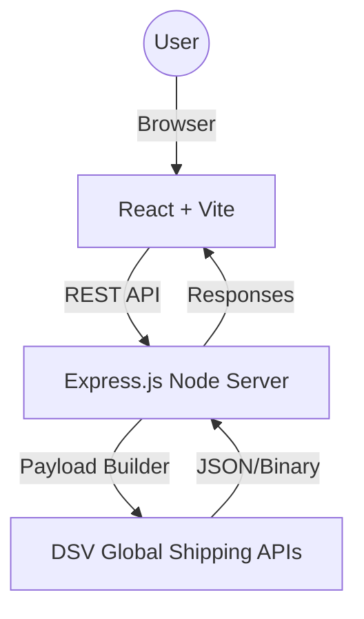

# System Design & Architecture

This document provides a technical overview of the DSV XPress API & Shipping Wizard for developers and architects.

## 🏛️ Architecture Overview

The system follows a classic **Client-Server Architecture** with a separation of concerns between the frontend (React) and the backend (Express.js).

## 💻 Frontend Layer (React)

- **State Management**: Uses React standard `useState` and `useEffect` for local state and data fetching.
- **Routing**: `react-router-dom` v6 for client-side navigation.
- **API Client**: `Axios` instance configured in `src/api/dsvApi.js` with centralized `baseURL` and error handling.
- **UI Components**:
  - **Shipping Wizard**: A multi-step form component (`ShippingWizard.jsx`) that manages nested child states for countries, dimensions, and booking details.
  - **Lucide React**: Used for modern, consistent iconography.

## ⚙️ Backend Layer (Express.js)

The backend acts as a secure proxy and data transformer between the client and DSV's enterprise APIs.

- **Config System**: Centralized environment variable management in `src/config/env.js`.
- **DSV Client**: A pre-configured Axios client (`src/config/dsv-api.js`) that handles authentication (Subscription Keys, PAT, and Service Auth) for all outgoing enterprise requests.
- **Controllers**:
  - `bookingController`: Orchestrates the complex multi-stage booking process (Draft -> Documents -> Confirm).
  - `trackingController`: Provides unified endpoints for multiple DSV tracking schemas (AWB, Carrier, Shipment ID).
  - `quoteController`: Handles dynamic rate calculations with integrated commission logic.
- **Utils (Payload Builder)**: Crucial component (`src/utils/payloadBuilder.js`) that transforms flat frontend data into the deeply nested JSON structures required by DSV. It also includes regex-based formatters for phone numbers and dates to ensure API compliance.

## 🔄 Core Data Flows

### 1. The 3-Step Booking Flow
1. **Selection**: User selects country and weight. Frontend calls `/api/quotes` for a live estimate.
2. **Dimensioning**: Frontend updates dimensions; payload builder ensures these are correctly passed to the final booking.
3. **Submission**: 
   - Frontend sends a simplified `shipmentData` object to `/api/bookings/simple`.
   - Backend transforms this data using `payloadBuilder`.
   - Backend submits to DSV and returns the `Shipment ID`.

### 2. Tracking Flow
1. User enters an ID.
2. Backend inspects the ID format (Length/Regex) to decide whether to hit the **Shipment**, **AWB**, or **Carrier** endpoint.
3. Event timeline is returned and rendered chronologically.

## 🛡️ Security Measures

- **Helmet Middleware**: Protects against common web vulnerabilities by setting various HTTP headers.
- **CORS**: Restricted to authorized origins (typically the local dev server or production frontend).
- **Credential Masking**: Sensitive DSV keys are never exposed to the frontend; they reside strictly in the backend `.env`.
- **Phone Formatting**: Automatic insertion of spaces and country codes to prevent validation failures.

## 🧪 Development & Certification

The system includes a **Certification Controller** used for DSV's enterprise testing/onboarding process, allowing developers to run specific test scenarios against the DSV sandbox.
