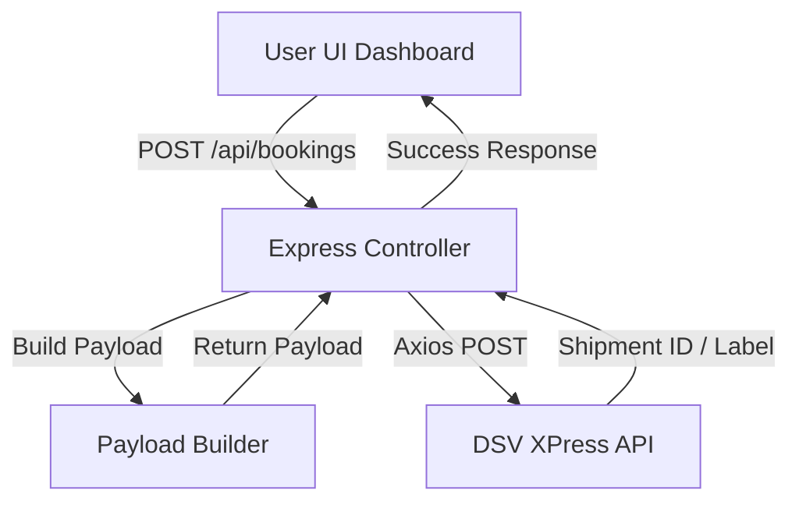

# 📦 DSV XPress API: Deep Technical Guide & Architecture

This guide provides a comprehensive overview of the DSV XPress integration, designed for developers and system administrators to understand the inner workings of the project.

---

## 🏗️ 1. System Architecture

The project is built on a modern Node.js stack, acting as a middleware bridge between your business logic and the DSV Global API.

### High-Level Workflow
1.  **Frontend (Vanilla JS/CSS/HTML)**: Captures user input and sends AJAX requests.
2.  **Middleware (Express.js)**: Validates requests, handles security (Helmet/CORS), and manages static file serving.
3.  **Controllers (Business Logic)**: Processes input, builds DSV-compliant payloads, and handles API orchestration.
4.  **Utilities (DSV Client)**: Specialized Axios client with automatic header injection (Subscription Key, Service Auth, PAT).
5.  **DSV API (External)**: Receives the processed payload and registers the shipment.



---

## 📂 2. Project Structure

```text
DSV_API/
├── src/
│   ├── app.js              # Entry point & Express configuration
│   ├── routes/
│   │   └── api.js          # API route definitions
│   ├── controllers/
│   │   ├── bookingController.js   # Handles simple/complex bookings
│   │   └── trackingController.js  # Live tracking orchestration
│   ├── middleware/
│   │   ├── auth.js         # Placeholder for API key/JWT validation
│   │   └── upload.js       # Multer config for doc uploads
│   ├── config/
│   │   ├── env.js          # Robust environment var management
│   │   └── dsv-api.js      # Global DSV Axios client
│   └── utils/
│       ├── payloadBuilder.js # Key Logic: Maps data to DSV specifications
│       └── labelGenerator.js # Future: PDF manipulation logic
├── public/                 # Premium Frontend
│   ├── css/
│   │   └── dashboard.css   # Glassmorphism Design System
│   ├── js/
│   │   └── dashboard.js    # SPA logic & Navigation
│   └── index.html          # Main Dashboard Shell
└── .env                    # Secure credential storage
```

---

## 🛠️ 3. Core API Endpoints

### Booking Interface
*   **`POST /api/bookings/simple`**: JSON-only endpoint for standard courier shipments.
*   **`POST /api/bookings/complex`**: Multipart endpoint supporting document attachments (Invoices, Declarations).

### Tracking Interface
*   **`GET /api/shipments/:shipmentId/tracking`**: Fetches real-time timeline data from DSV and returns a JSON array of events.

---

## 🔧 4. Technical Specifications & Integration

### Authentication Headers
Every request to DSV must contain these specific headers, managed centrally in `src/config/dsv-api.js`:
- `dsv-subscription-key`: Primary API access key.
- `dsv-service-auth`: Client-specific service authorization.
- `x-pat`: Personal Access Token for the XPress domain.

### Environment Management
The project uses a strict environment variable system (`src/config/env.js`) to ensure secrets like `DSV_SUBSCRIPTION_KEY` are never hardcoded. This allows for seamless transitions between **Demo** and **Production** environments just by switching the `.env` file.

---

## 🇧🇩 5. Multi-language Support
The platform supports real-time language switching (Bangla/English) without page reloads. This is handled by a frontend translation dictionary in `dashboard.js`, updating the DOM elements dynamically based on the selected locale.

---

## 🚀 6. Future Expansion
1.  **Automated Label Printing**: Hooking into local thermal printers for warehouse automation.
2.  **Webhooks**: Receiving real-time status updates from DSV without polling.
3.  **Rate API Integration**: Calculating shipping costs before confirming bookings.

---

> [!IMPORTANT]
> **Security Audit**: Ensure `NODE_ENV` is set to `production` when deploying to hide detailed error stacks from unauthorized users.
