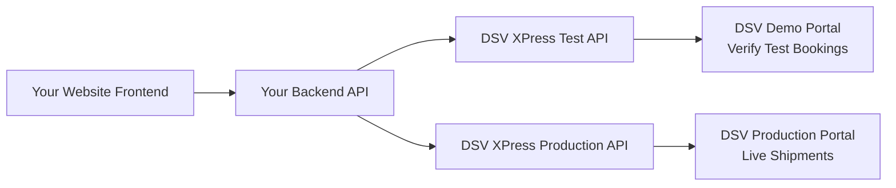

# DSV XPress Booking API Integration  
**Comprehensive Implementation Guide for Web Development Team**  

---

## 📌 Project Overview  
This document provides complete specifications for integrating **DSV XPress Booking API** into your e-commerce/shipping website. The integration enables customers to:  
✅ Get real-time shipping quotes  
✅ Create domestic/international shipments  
✅ Upload required shipping documents  
✅ Generate printable shipping labels (PDF/ZPL)  
✅ Track shipments post-booking  
✅ Cancel bookings within allowed windows  

**Target Audience**: Google Gravity development team  
**Critical Path**: Certification required before production deployment  
**Technology Recommendation**: Node.js backend (aligns with modern web stacks)  

---

## 🔑 Critical Prerequisites  
*(Must be completed BEFORE development starts)*  

| Requirement | Source | Timeline | Owner |
|-------------|--------|----------|-------|
| DSV Developer Portal account | [developer.dsv.com](https://developer.dsv.com) | Week 1 | Client |
| API subscription approval | DSV team (email) | 3-5 business days | Client |
| **Test environment credentials** | DSV approval email | Upon subscription | Client |
| Certification test access | API Validation Portal | After subscription | Client |
| **Production credentials** | After certification pass | Post-certification | DSV Team |

> ⚠️ **NO PRODUCTION DEPLOYMENT POSSIBLE WITHOUT PASSING CERTIFICATION TESTS**  
> *See Section 5: Certification Process*

---

## 🌐 Recommended Architecture  


### Why Node.js? (Recommended Stack)
| Factor | Node.js Advantage |
|--------|-------------------|
| **Async Operations** | Perfect for API chaining (draft → upload → confirm) |
| **Frontend Alignment** | Shared JS/TS with React/Next.js frontend |
| **File Handling** | Stream document uploads/downloads efficiently |
| **Ecosystem** | Rich libraries: `axios`, `multer`, `dotenv`, `express` |
| **Deployment** | Seamless on Vercel, AWS, Azure, or Docker |

> 💡 *Python alternative viable if team has strong Flask/Django expertise, but Node.js preferred for full-stack consistency*

---

## 📁 Project Structure (Node.js Implementation)
```bash
dsv-xpress-integration/
├── src/
│   ├── config/
│   │   ├── env.js              # Environment variables loader
│   │   └── dsv-api.js          # API client with auth headers
│   ├── controllers/
│   │   ├── bookingController.js # Main workflow logic
│   │   ├── documentController.js
│   │   └── trackingController.js
│   ├── routes/
│   │   ├── api.js              # /api/bookings, /api/documents, etc.
│   │   └── webhooks.js         # For DSV status updates (optional)
│   ├── middleware/
│   │   ├── auth.js             # Validate user sessions
│   │   └── certification.js    # Inject x-cert-id header during tests
│   ├── utils/
│   │   ├── labelGenerator.js   # Save/process labels
│   │   └── documentValidator.js # Check mandatory docs per country
│   └── app.js                  # Express server setup
├── public/
│   └── labels/                 # Temporary label storage (clean daily)
├── tests/
│   ├── certification/          # TC1-TC5 test scripts
│   └── integration.test.js
├── .env.example                # Template for credentials
├── package.json
└── README_DEVELOPMENT.md       # Internal dev notes
```

---

## 🔐 Environment Variables (`.env.example`)
```env
# DSV API CREDENTIALS (TEST ENVIRONMENT)
DSV_SUBSCRIPTION_KEY="b5c09b92fbf24d62a17caad22227c470"
DSV_SERVICE_AUTH="e4e5a4d.f1fbc48e1a0848b4d64e7bf23"
DSV_PAT="bbmiPcs2uFY3fN9R0lju"

# API ENDPOINTS
DSV_BOOKING_API="https://api-test.dsv.com/xpress/booking"
DSV_RATE_API="https://api-test.dsv.com/xpress/rate"
DSV_TRACKING_API="https://api-test.dsv.com/xpress/tracking"

# APPLICATION SETTINGS
NODE_ENV="development"
PORT=3001
LABEL_STORAGE_PATH="./public/labels"
MAX_UPLOAD_SIZE="10mb"  # For document uploads

# CERTIFICATION MODE (SET TO true DURING TESTING)
CERTIFICATION_MODE=false
CERTIFICATION_TEST_ID="TC1"  # Change per test case
```

---

## 🚀 Core Workflow Implementation  
### Simple Booking Flow (Domestic/EU)
```javascript
// src/controllers/bookingController.js
exports.createSimpleBooking = async (req, res) => {
  try {
    // 1. Submit draft booking
    const draft = await dsvAPI.submitDraftBooking(req.body.shipmentData);
    
    // 2. Confirm booking + get label
    const confirmed = await dsvAPI.confirmBooking(draft.draftId, 'PDF');
    
    // 3. Save label to server & return URL
    const labelPath = await saveLabel(confirmed.labelData, draft.draftId);
    
    res.status(201).json({
      success: true,
      bookingId: confirmed.bookingId,
      shipmentId: confirmed.shipmentId,
      labelUrl: `/labels/${path.basename(labelPath)}`,
      trackingUrl: `https://track.dsv.com?shipmentId=${confirmed.shipmentId}`
    });
  } catch (error) {
    // Handle DSV-specific errors (cancellation window, invalid docs, etc.)
    handleError(res, error);
  }
};
```

### Complex Booking Flow (International)
```javascript
exports.createComplexBooking = async (req, res) => {
  // 1. Submit draft
  const draft = await dsvAPI.submitDraftBooking(req.body.shipmentData);
  
  // 2. Upload ALL required documents (validated per country)
  for (const doc of req.files) {
    await dsvAPI.uploadDocument(draft.draftId, doc.fieldname, doc.buffer, doc.originalname);
  }
  
  // 3. Confirm booking
  const confirmed = await dsvAPI.confirmBooking(draft.draftId, 'PDF');
  // ... same as simple flow
};
```

---

## 📜 Critical: Certification Process (NON-NEGOTIABLE)  
**Before ANY production deployment:**  

1. **Access Portal**:  
   `https://api-validation.dsv.com` (credentials in approval email)  
   
2. **Required Test Cases**:  
   | Test ID | Scenario | Critical? |
   |---------|----------|-----------|
   | TC1 | Submit draft booking (simple) | ✅ Mandatory |
   | TC2 | Upload document (complex) | ✅ Mandatory |
   | TC3 | Confirm booking + get label | ✅ Mandatory |
   | TC4 | Cancel booking (within window) | ✅ Mandatory |
   | TC5 | Error handling (invalid data) | ✅ Mandatory |
   
3. **Implementation in Code**:  
   ```javascript
   // src/middleware/certification.js
   const certificationMiddleware = (req, res, next) => {
     if (process.env.CERTIFICATION_MODE === 'true') {
       req.headers['x-cert-id'] = process.env.CERTIFICATION_TEST_ID;
     }
     next();
   };
   // Apply to all DSV API routes
   router.use('/api/bookings', certificationMiddleware, bookingRoutes);
   ```
   
4. **Verification**:  
   - Run tests via API Validation Portal UI  
   - OR use Postman collections (provided by DSV)  
   - **ALL TESTS MUST SHOW "PASSED"** in portal dashboard  
   - Submit "Go-Live Request" only after 100% pass rate  

> 📌 **Client Action Required**: Provide Google Gravity team with:  
> 1. Test environment credentials  
> 2. API Validation Portal login  
> 3. Signed go-live authorization form (from DSV)  

---

## 🌍 Country-Specific Document Requirements  
*(Critical for complex bookings)*  

| Trade Lane | Mandatory Documents | Implementation Tip |
|------------|---------------------|-------------------|
| **Non-EU → EU** | Commercial Invoice, Packing List | Auto-detect country codes in frontend |
| **EU → Non-EU** | Commercial Invoice, Export Declaration | Show document checklist pre-booking |
| **Restricted Countries** | DG Certificate, Import License | Block booking if missing docs |
| **All International** | Proforma Invoice | Validate file types (PDF only) |

**Recommendation**:  
- Build document validator utility:  
  ```javascript
  // src/utils/documentValidator.js
  const getRequiredDocs = (originCountry, destCountry, commodity) => {
    // Return array of required doc types based on DSV's matrix
    // Example: ['commercial_invoice', 'packing_list']
  };
  ```
- Show dynamic document checklist in UI before booking submission

---

## 🧪 Testing Strategy  
| Test Type | Tool | Owner | Frequency |
|-----------|------|-------|-----------|
| **Certification Tests** | API Validation Portal | Dev Team | Pre-production |
| **Integration Tests** | Jest + Mock DSV API | Dev Team | Pre-commit |
| **Document Upload** | Postman Collection | QA Team | Weekly |
| **Label Generation** | Visual diff (PDF/ZPL) | QA Team | Per release |
| **Error Handling** | Chaos engineering | Dev Team | Monthly |

---

## 🚨 Critical Error Handling Scenarios  
| Error Code | User-Facing Message | Action |
|------------|---------------------|--------|
| `401` | "Authentication failed. Contact support." | Alert admin |
| `403` | "Booking not permitted for this route." | Show alternative services |
| `422` | "Missing required document: [doc name]" | Highlight missing doc in UI |
| `409` | "Cancellation window expired." | Show policy details |
| `5xx` | "Service temporarily unavailable. Retry in 5 min." | Auto-retry + notify |

---

## 📬 Next Steps for Google Gravity Team  
1. **Client provides**:  
   - Test environment credentials  
   - Signed project scope document  
   - Country/commodity matrix for document validation  
   
2. **Development phases**:  
   ```mermaid
   timeline
       title Implementation Timeline
       section Phase 1
         Week 1 : Environment setup + auth integration
         Week 2 : Draft booking + confirmation flow
       section Phase 2
         Week 3 : Document upload system
         Week 4 : Certification test execution
       section Phase 3
         Week 5 : Frontend integration (UI components)
         Week 6 : UAT + production deployment prep
   ```

3. **Deliverables**:  
   - ✅ Fully certified Booking API integration  
   - ✅ Admin dashboard for label management  
   - ✅ Customer-facing booking flow with document upload  
   - ✅ Webhook handler for shipment status updates  
   - ✅ Comprehensive error logging system  
   - ✅ Deployment runbook for production cutover  

---

## 📚 Essential Resources  
| Resource | URL | Purpose |
|----------|-----|---------|
| **Official API Docs** | developer.dsv.com/xpress | Endpoint specs, schemas |
| **Postman Collections** | In Developer Portal | Test requests |
| **Certification Guide** | API Validation Portal | Test case details |
| **Country Document Matrix** | XPress Demo Portal > Help | Mandatory docs per route |
| **Support Portal** | support.dsv.com/api | Ticket submission |

---

> **Disclaimer**: This integration requires strict adherence to DSV's certification process. **No production traffic permitted until certification is fully approved by DSV.** All credentials must be stored in environment variables - NEVER commit to source control.  
>  
> **Prepared for**: Google Gravity Development Team  
> **Client**: [Your Company Name]  
> **Date**: February 2, 2026  
> **DSV API Version**: XPress v3.1 (2026)  

📄 *This document contains implementation-critical information. Distribute only to authorized project members.*  
© 2026 DSV Integration Project | Confidential